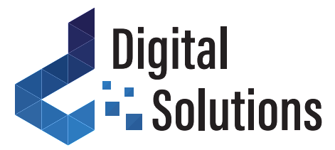
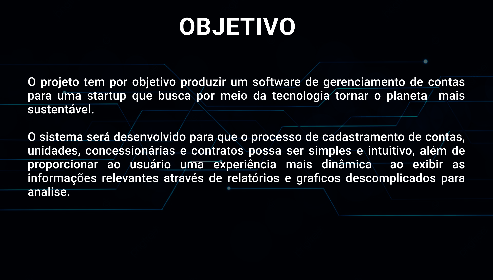
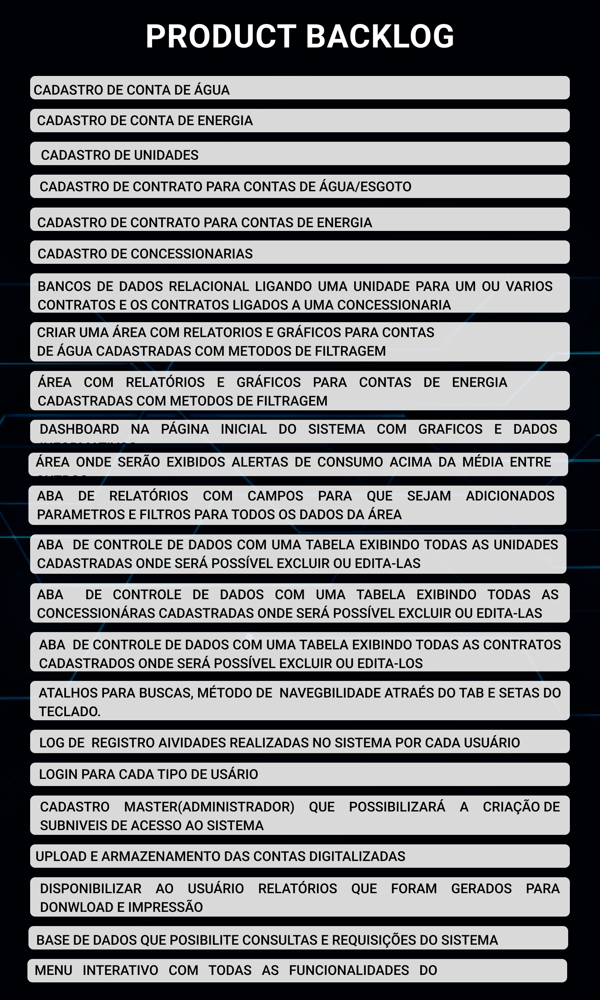
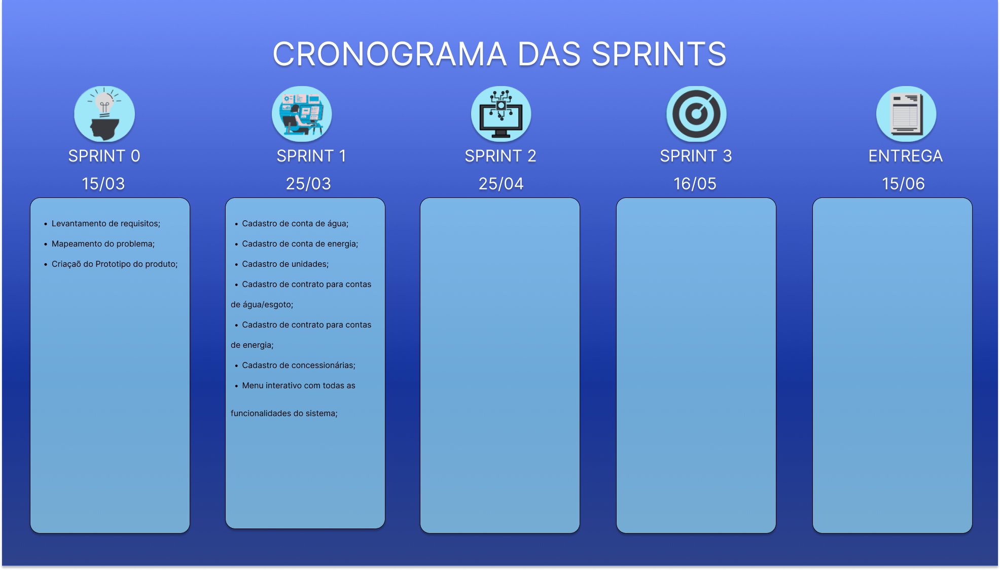
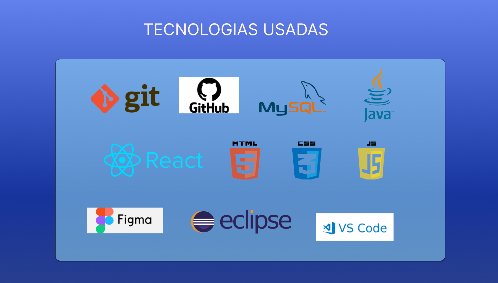
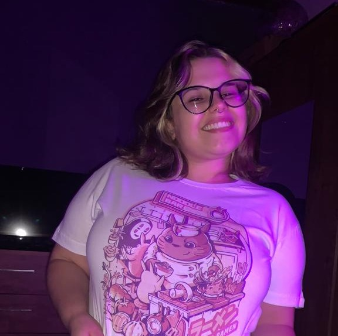

 
 

  <a href ="#o-projeto"> Projeto </a>  • 
  <a href ="#product-backlog">Product Backlog </a>  •
  <a href ="#proposta"> Proposta </a>  • 
  <a href ="#cronograma-das-sprints"> Sprints </a>  • 
  <a href ="#tecnologias-utilizadas"> Tecnologias </a>  •
  <a href ="#tabela_equipe"> Equipe </a> 
 

 

# O Projeto

<h1 align="center"> 
</h1>

 

## 📋 Product Backlog

<!--add product backlog figma figma-->
<h1 align="center">
</h1>

 

### **Status do Projeto: Em progresso.**

 

## 🎯 Proposta

### **Desenvolver um software que atenda as necessidades da empresa:**  

### **Requisitos funcionais**   
-  Cadastros de Unidades, Concessionárias, Contratos;
-  Cadastro do usuário e seus perfis (administrador, gestor e digitador);
-  Cadastro (digitação) da conta de água e energia;
-  Registro de log de operações (cadastro e deleção);
-  Relatório de consumo total de água mensal, anual e média;
-   Relatório de consumo total de energia mensal, anual e média;
-  Painel adminitrativo para alterações;
-  Emissão de relatorios;
-  Geração de alertas de consumo acima da média (a média pode ser definida no cadastro
do contrato);

### **Requisitos não funcionais**    

-  Prezar pelo UX da tela de digitação das contas;
-  Incluir atalhos no nos formmulários de casdastro;
-  Permitir navegação entre campos por TAB ou seta;
<h1> 

   

## 📆 Cronograma das Sprints

-   Kick-Off - 15/03/2022
-  <a href="https://github.com/Grupo1API/TecSus/tree/main/readme/sprint_1">Sprint 1</a> - 25/03/2022 a 14/04/2022 
-  <a href="https://github.com/Grupo1API/TecSus/tree/main/readme/sprint_2">Sprint 2</a> - 04/2022 a 15/05/2022   
-  [ Sprint 3 ]( ) - 16/05/2022 a 05/06/2022  
-  [Feira de Soluções](https://youtu.be/xGE51h8fBuY) - 15/06/2022

 
<!--add cronograma sprints figma-->
<h1 align="center"> 
</h1>

 

  ## 🖥️ Tecnologias Utilizadas

- **Banco de Dados:** MySQL;
- **Back-end:** Spring, Java;
- **Front-end:** HTML, CSS, JavaScript, React;
- **Ferramentas:** Visual Studio Code, Eclipse, Figma, Git e Github;   

<!--add stacks figma-->
<h1 align="center"> 
  
</h1>

## 👨‍💻 Equipe

 

| Nome                  | Função        | Linkedin                                                                 | GitHub                                         | Avatar                                                          |
| --------------------- | ------------- | ------------------------------------------------------------------------ | ---------------------------------------------- | --------------------------------------------------------------- |
| **Vitória Moura**     |  Scrum Master | [@LinkedIn](https://www.linkedin.com/in/vit%C3%B3ria-moura-6393391b0/)   | [@GitHub](https://github.com/vitoriasaturnino)    |                                    |
| **Julio Cesar**       | Product Owner | [@LinkedIn](https://www.linkedin.com/in/juliocesar2811/)                 | [@GitHub](https://github.com/juliocesar1316)   |                    |
| **Douglas Queiroz**   | Desenvolvedor | [@LinkedIn](https://www.linkedin.com/in/douglas-queiroz-3b9a72212/)      | [@GitHub](https://github.com/douglaswe)        | 
| **Francisco Quirino** | Desenvolvedor | [@LinkedIn](https://www.linkedin.com/in/francisco-quirino-4087281b1)     | [@GitHub](https://github.com/ciscoquirino)     |  |
| **Juliana Maria**     | Desenvolvedora | [@LinkedIn](https://www.linkedin.com/in/juliana-maria-a0b0a0124)         | [@GitHub](https://github.com/JulianaMaria-Lab) |                                    |
| **Marcelo Uchoas**    | Desenvolvedor | [@LinkedIn](https://www.linkedin.com/in/marcelo-uch%C3%B4as-de-oliveira-b2536a18b/)  |  [@GitHub](https://github.com/marcelouchoas)    |                                    |
| **Richard Rafael**    | Desenvolvedor |  [@LinkedIn](https://www.linkedin.com/mwlite/in/richard-soares-002195221) | [@GitHub](https://github.com/Richardrafael)    |                                    |

