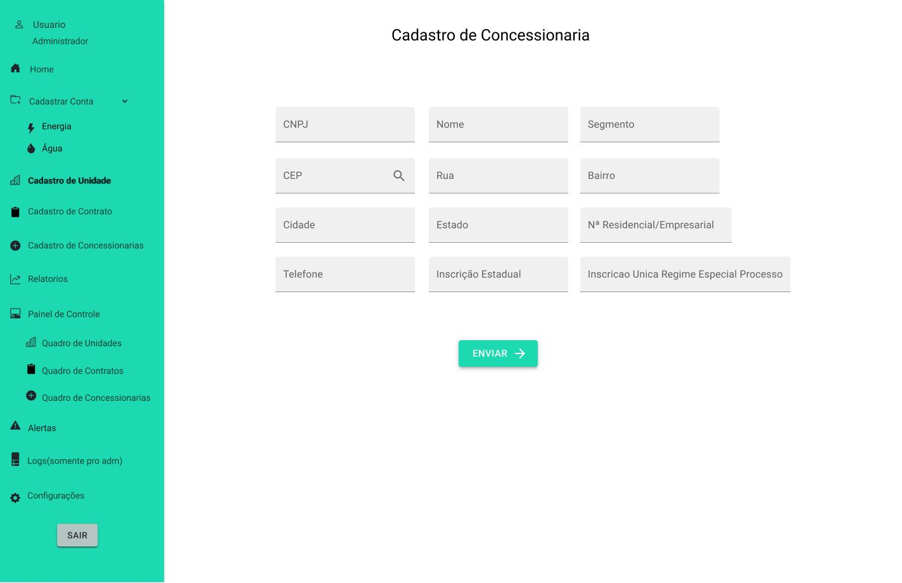
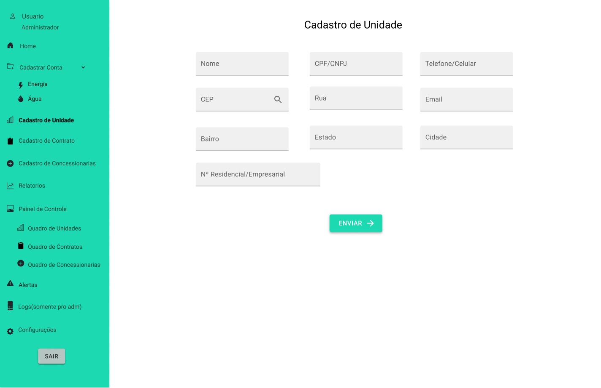
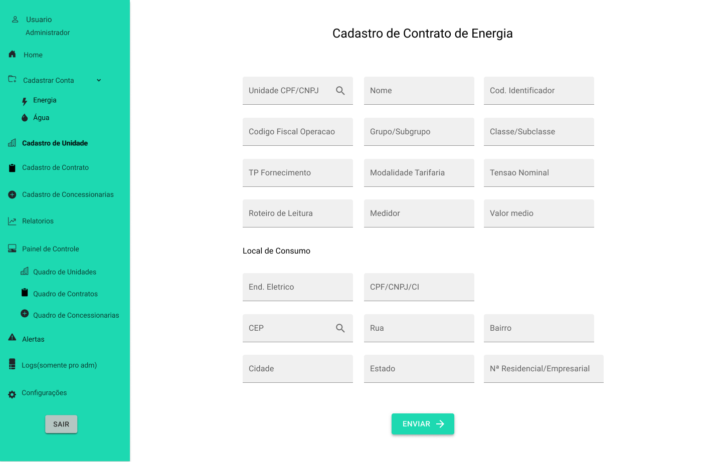
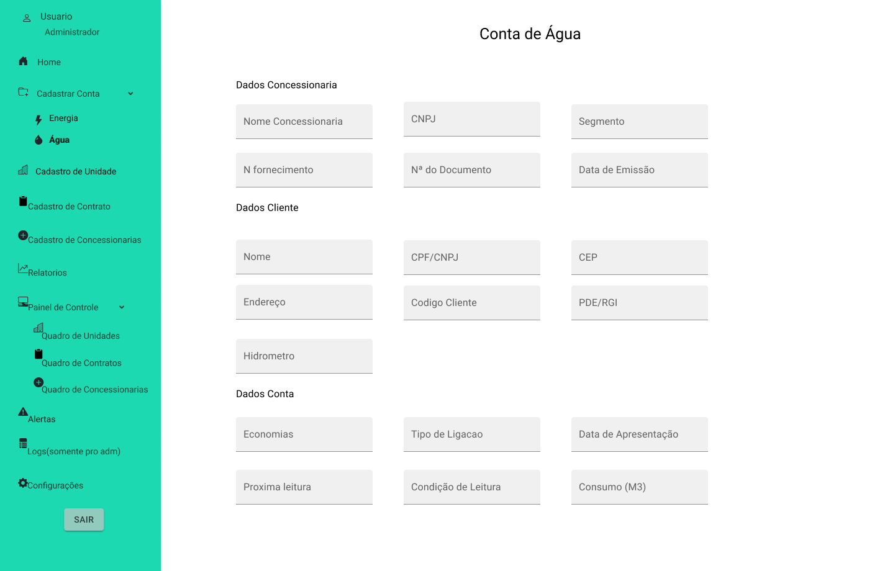

<a href="/readme/grupoAPI/Logo.png">Digital Solutions</a>

<h1>:ballot_box_with_check: SPRINT 1</h1>

Após o cliente aprovar o protótipo apresentado, o desenvolvimento do projeto se baseou em focar no principal objetivo do sistema, que é o cadastro e gerenciam de dados, desenvolvendo a princípio as principais funções: Cadastro de conta de energia e água, contratos de fornecimento para energia e água, cadastro para concessionárias responsáveis pela distriuição e unidades que recebem esses serviços.

 

<h1>Definition of Ready
</h1>

 

<h2 align="center">Modelo de dados<h2>
</h2>

 

<h2>Wire frames</h2>

<h3 align="center">Formulário para cadastro de concessionárias

<h3 align="center">Formulário para cadastro de unidades</h3>

<h3 align="center">Formulário para cadastro de contrato de fornecimento de água</h3>

<h3 align="center">Formulário para cadastro de contrato de fornecimento de energia</h3>

<h3 align="center">Formulário para cadastro conta/fatura de água</h3>

<h3 align="center">Formulário para cadastro conta/fatura de energia</h3>

 

<h2>Burndown da Sprint<h2>

<h3 align="center">
</h3>

 

<h1>Definition of Done<h1>

<h2>Funcionalidades da Sprint</h2>

 

<h3 align="center">Formulário para cadastro de concessionárias</h3>

 

<h3 align="center">Formulário para cadastro de unidades</h3>

 

<h3 align="center">Formulário para cadastro de contrato de fornecimento de água</h3>

 

<h3 align="center">Formulário para cadastro de contrato de fornecimento de energia</h3>

 

<h3 align="center">Formulário para cadastro conta/fatura de água</h3>

 

<h3 align="center">Formulário para cadastro conta/fatura de energia</h3>
