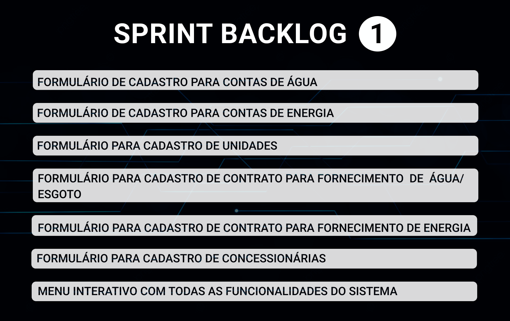
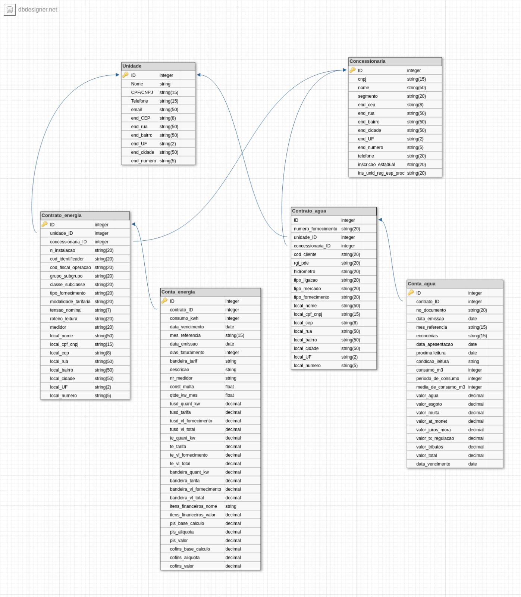
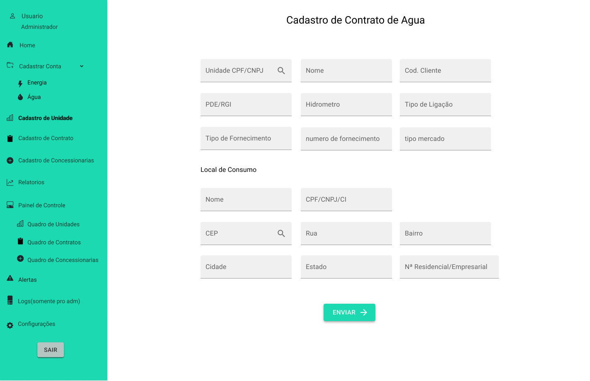
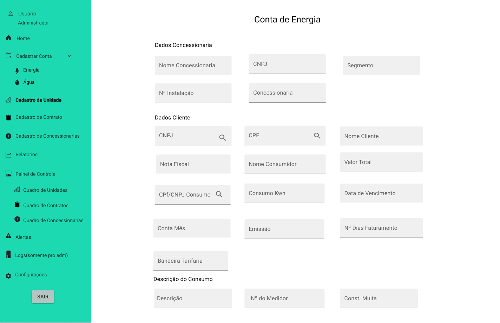
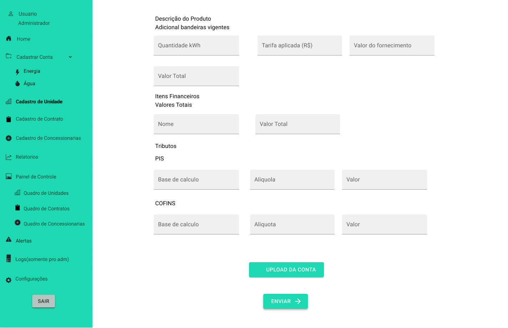
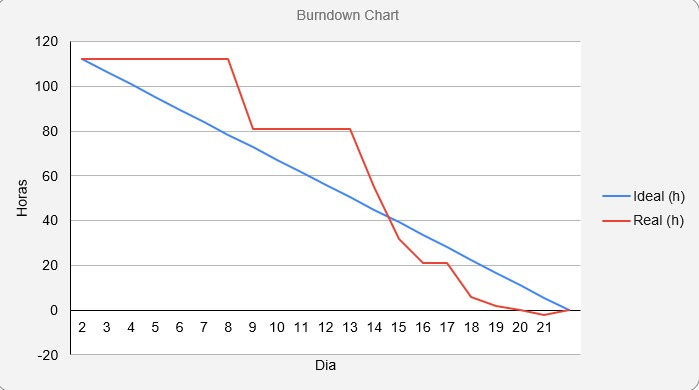
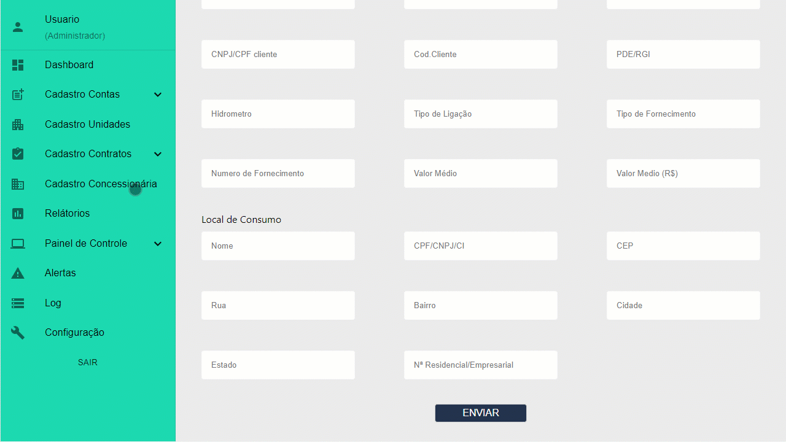
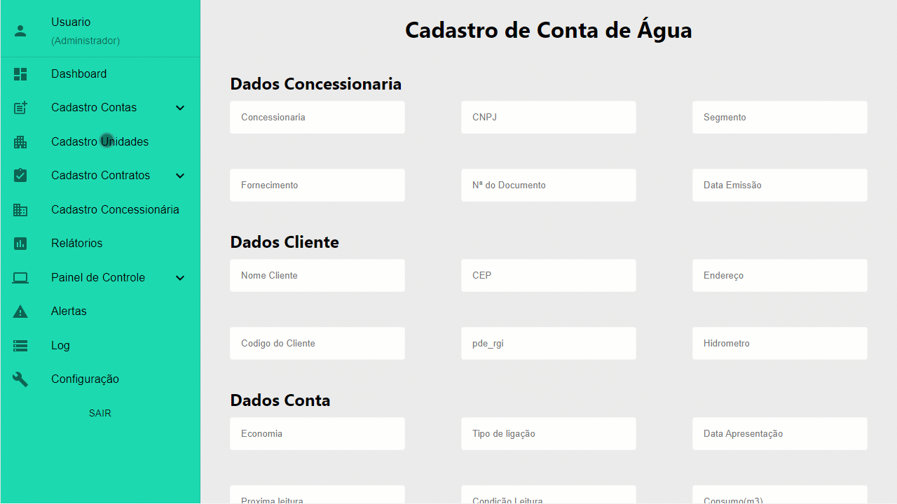

<a href="/readme/grupoAPI/Logo.png">Digital Solutions</a>

<h1>:ballot_box_with_check: SPRINT 1</h1>

Após o cliente aprovar o protótipo apresentado, o desenvolvimento do projeto se baseou em focar no principal objetivo do sistema, que é o cadastro e gerenciam de dados, desenvolvendo a princípio as principais funções: Cadastro de conta de energia e água, contratos de fornecimento para energia e água, cadastro para concessionárias responsáveis pela distriuição e unidades que recebem esses serviços.

<h1>Sumário</h1>
<a href="#dor">DOR (Definition od Ready)</a>    
<a href="#backlog_sprint_1">Backlog Sprint 1</a>    
<a href="#modelo_de_dados">Modelo de dados</a>    
<a href="#use_cases">Use Cases</a>    
<a href="#wireframes">Wireframes</a>    
<a href="#burndown_sprint_1">Burndowm Sprint 1</a>    
<a href="#dod">DOD (Definition of Done)</a>    
<a href="#funcionalidades_sprint_1">Funcionalidades implementadas</a>

 

<h1 id="dor">Definition of Ready</h1>
 

</h1>

 

<h2 id="modelo_de_dados">Modelo de dados</h2>

<h2 id="use_cases">Use Cases</h2>

  <table align="justify">
    <tr>
      <th>User Story id</th>
      <th>Como um (ator)</th>
      <th>Eu quero (ação)</th>
      <th>Para que seja possível (funcionalidade)</th>
      <th>Prioridade</th>
    </tr>
    <tr>
      <td>1</td>
      <td>Digitador</td>
      <td>Guardar no sistema os dados das contas de água para analises, relatorios e ter um controle de sistema</td>
      <td>Criar um cadastro de conta de agua de maneira funcional e pratico </td>
      <td>1</td>
    </tr>
    <tr>
      <td>2</td>
      <td>Digitador</td>
      <td>Guardar no sistema os dados das contas de energia para analises, relatorios e ter um controle de sistema</td>
      <td>Criar um cadastro de conta de energia de maneira funcional e pratico </td>
      <td>2</td>
    </tr>
    <tr>
      <td>3</td>
      <td>Digitador</td>
      <td>Guardar no sistema dados de unidades e ou empresas para analises, relatorios e ter um controle de sistema</td>
      <td>Criar um cadastro de unidades de maneira funcional e pratico </td>
      <td>3</td>
    </tr>
    <tr> 
      <td>4</td>
      <td>Digitador</td>
      <td>Guardar no sistema dados de concessionaria que faz o fornecimento para tais unidades  para analises, relatorios e ter um controle de sistema</td>
      <td>Criar um cadastro de concessionarias de maneira funcional e pratico </td>
      <td>4</td>
    </tr>
    <tr>
      <td>5</td>
      <td>Digitador</td>
      <td>Cadastrar os contratos acordado com os clientes e unidade com sua respectiva concessionaria do segmento de agua/esgoto</td>
      <td>Criar um cadastro de contrato para contas de agua/esgoto</td>
      <td>5</td>
    </tr>
    <tr>
      <td>6</td>
      <td>Digitador</td>
      <td>Cadastrar os contratos acordado com os clientes e unidade com sua respectiva concessionaria do segmento de energia</td>
      <td>Criar um cadastro de contrato para contas de energia</td>
      <td>6</td>
    </tr>
    <tr>
      <td>23</td>
      <td>Gestor, Digitador e Adminnistrador</td>
      <td>Um sistema com bastante atalhos, que fique bem usual para os usuarios e de facil entendimento</td>
      <td>O sistema deve ser montado com menu lateral esquerdo com as abas de acesso totalmente limpo e de facil acesso e para areas externas do menu vao ser utilizados mais ou menos 100% da tela</td>
      <td>23</td>
    </tr>
  </table>

 

<h2 id="wireframes">Wireframes</h2>

<h3 align="center">Formulário para cadastro de concessionárias

<h3 align="center">Formulário para cadastro de unidades
</h3>

<h3 align="center">Formulário para cadastro de contrato de fornecimento de água
</h3>

<h3 align="center">Formulário para cadastro de contrato de fornecimento de energia
</h3>

<h3 align="center">Formulário para cadastro conta/fatura de água

</h3>

<h3 align="center">Formulário para cadastro conta/fatura de energia

</h3>

 

<h2 id="burndown_sprint_1">Burndown da Sprint<h2>

<h3 align="center">
</h3>

 

<h1 id="dod">Definition of Done<h1>

<h2 id="funcionalidades_sprint_1">Funcionalidades da Sprint</h2>

 

<h3 align="center">Formulário para cadastro de concessionárias</h3>

 

<h3 align="center">Formulário para cadastro de unidades</h3>

 

<h3 align="center">Formulário para cadastro de contrato de fornecimento de água</h3>

 

<h3 align="center">Formulário para cadastro de contrato de fornecimento de energia</h3>

 

<h3 align="center">Formulário para cadastro conta/fatura de água</h3>

 

<h3 align="center">Formulário para cadastro conta/fatura de energia</h3>

