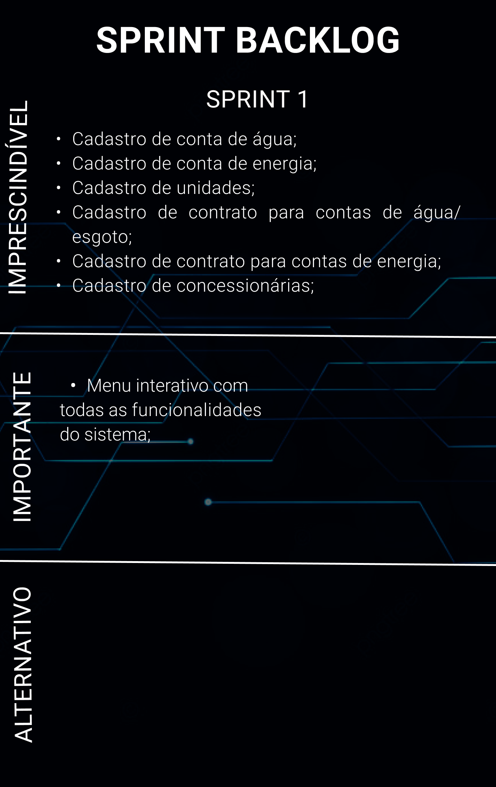
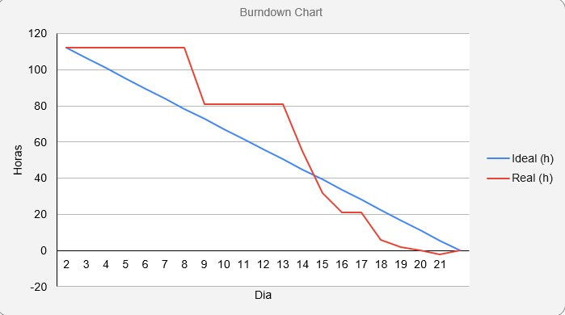

# [Digital Solutions](/readme/grupoAPI/Logo.png)

## :ballot_box_with_check: SPRINT 1

Após o cliente aprovar o protótipo apresentado, o desenvolvimento do projeto se baseou em focar no principal objetivo do sistema, que é o cadastro e gerenciam de dados, desenvolvendo a princípio as principais funções: Cadastro de conta de energia e água, contratos de fornecimento para energia e água/esgoto, cadastro para concessionárias responsáveis pela distriuição e unidades que recebem esses serviços.

 

<h1 align="center"> 
</h1>
 

## Burndown da Sprint

<h1 align="center"> </h1>

 

## :desktop_computer: Funcionalidades da Sprint

<h3 align="center">Interface</h3>

<h1 align="center"> </h1>

 

<h3 align="center">Cadastro Colaborador</h3>

<h1 align="center"> </h1>

 

<h3 align="center">Controle de Presença</h3>

<h1 align="center"> </h1>

<h3 align="center">Banco de dados</h3>

<h1 align="center"> </h1>