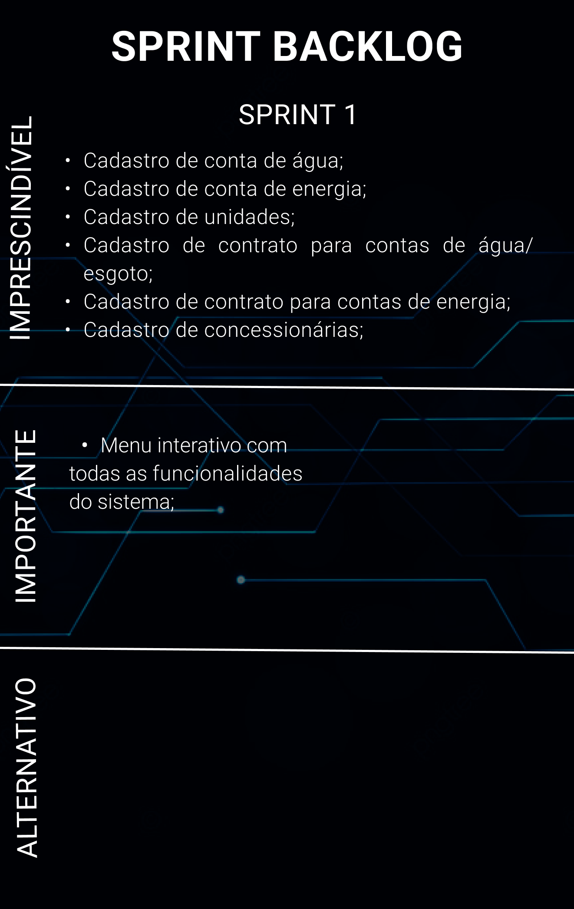
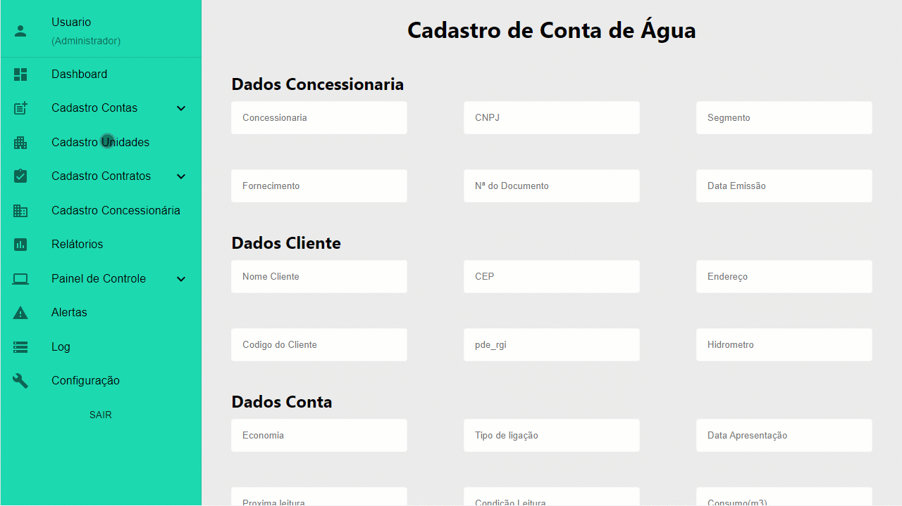
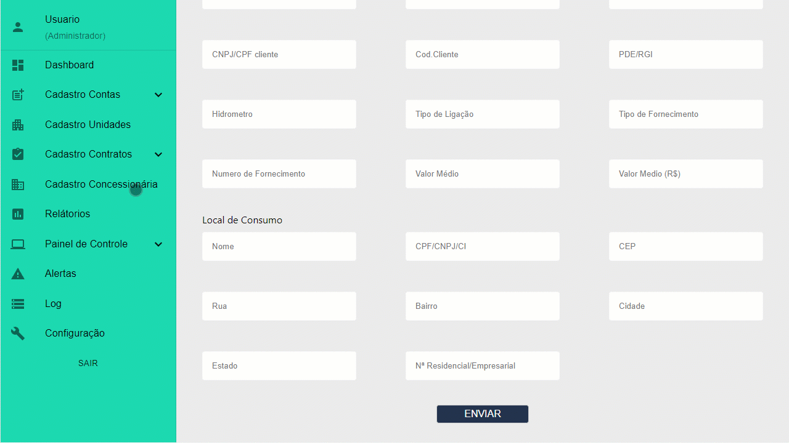

# [Digital Solutions](/readme/grupoAPI/Logo.png)

## :ballot_box_with_check: SPRINT 1

Após o cliente aprovar o protótipo apresentado, o desenvolvimento do projeto se baseou em focar no principal objetivo do sistema, que é o cadastro e gerenciam de dados, desenvolvendo a princípio as principais funções: Cadastro de conta de energia e água, contratos de fornecimento para energia e água, cadastro para concessionárias responsáveis pela distriuição e unidades que recebem esses serviços.

 

<h1 align="center"> 
</h1>
 

## Burndown da Sprint

<h1 align="center"> </h1>

 

## 🖥️ Funcionalidades da Sprint

#

<h3 align="center">Cadastro para conta de água</h3>
<h1 align="center"> </h1>

<h3 align="center">Cadastro para conta de energia</h3>
<h1 align="center"> </h1>

<h3 align="center">Cadastro para contrato de fornecimento de água</h3>
<h1 align="center"> </h1>

<h3 align="center">Cadastro para unidade</h3>
<h1 align="center"> </h1>

<h3 align="center">Cadastro para concessionária</h3>
<h1 align="center"> </h1>