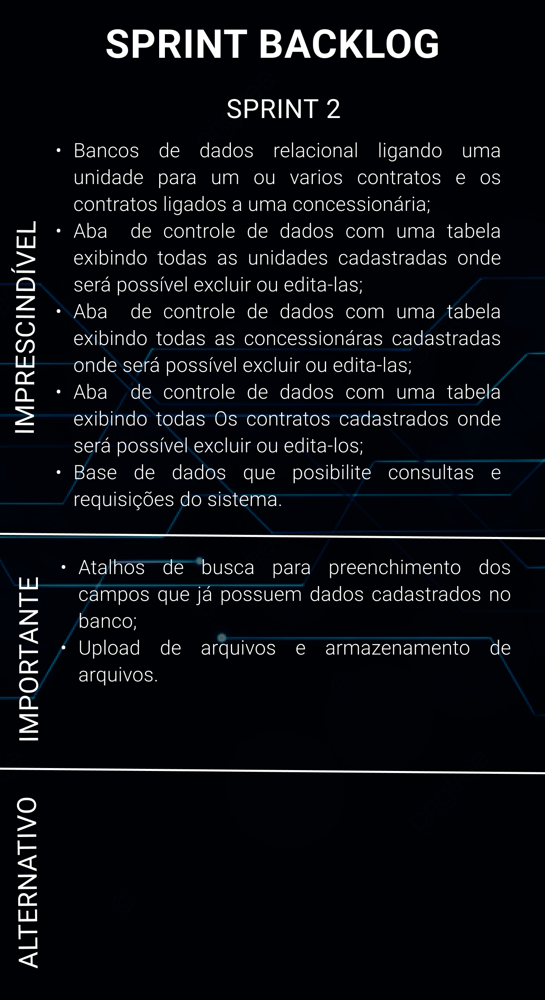
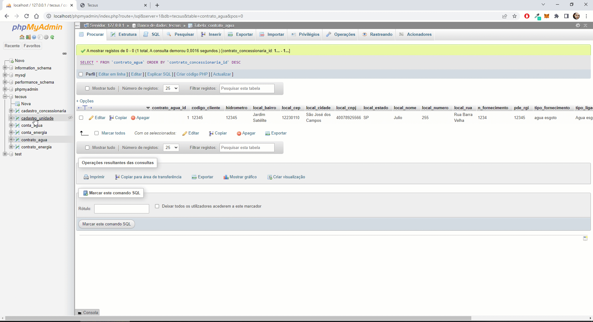
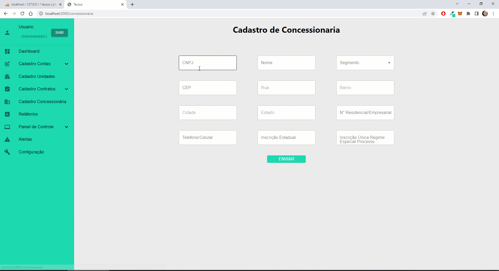
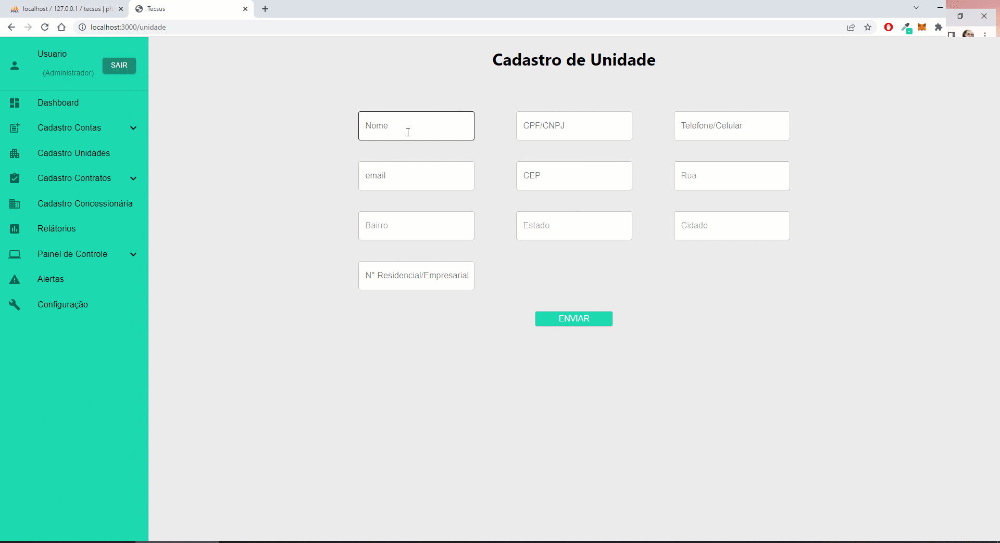
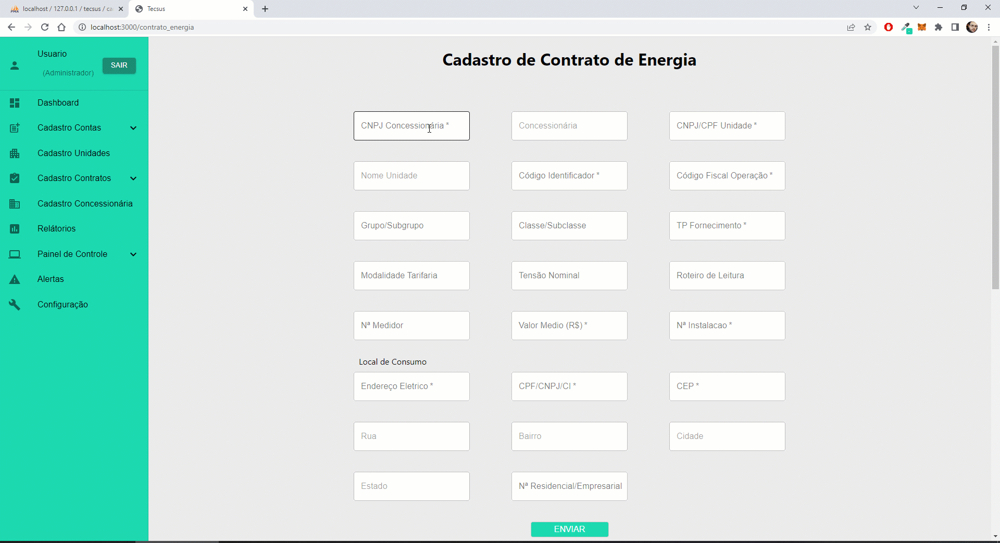
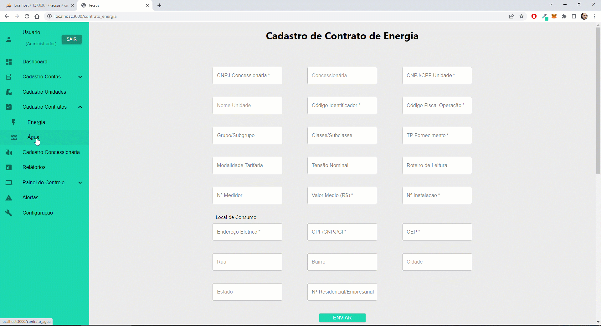

# [Digital Solutions](/readme/grupoAPI/Logo.png)

## :ballot_box_with_check: SPRINT 2

Nesta sprint mantivemos o foco na implementação da ligação entre as tabelas do banco de dados, na implementação de atalhos para preenchimento de campos do formulário, upload para aquivos (contas de água e energia) e na disponibilização dos dados cadastrados atráves de um quadro que possibilita edições e deleção diretamente pela interface do software.
 

<h1 align="center"> 
</h1>
 

## Burndown da Sprints

<h1 align="center"> </h1>

  

## 🖥️ Funcionalidades da Sprint
#

<h3 align="center">Banco de Dados Relacional</h3>
<h1 align="center"> </h1>

<h3 align="center">Atalhos para preencimento dos campos no formulário para cadastro de Concessionário</h3>
<h1 align="center"> </h1>

<h3 align="center">Atalhos para preencimento dos campos no formulário para cadastro de Unidades</h3>
<h1 align="center"> </h1>

<h3 align="center">Atalhos para preencimento dos campos no formulário para cadastro de contrato para fornecimento de energia</h3>
<h1 align="center"> </h1>

<h3 align="center">Atalhos para preencimento dos campos no formulário para cadastro de contrato fornecimento água</h3>
<h1 align="center"> </h1>

<h3 align="center">Demo dos atalhos de preenchimento nos campos do formulário de cadastro das contas (água e energia)</h3>
<h1 align="center"> </h1>

<h3 align="center">Quadros para edição e deleção de dados cadastrados</h3>
<h1 align="center"> </h1>

