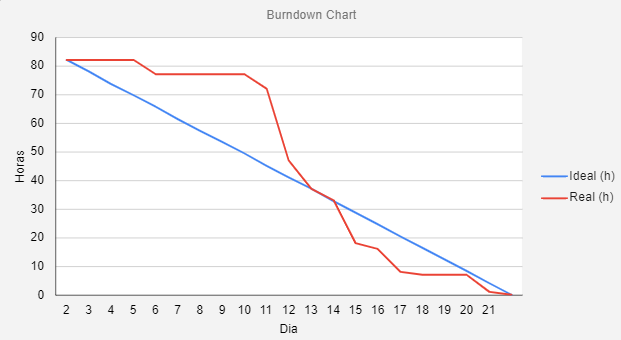

<a href="/readme/grupoAPI/Logo.png">Digital Solutions</a>

<h1>:ballot_box_with_check: SPRINT 2</h1>

Nesta sprint mantivemos o foco na implementação da ligação entre as tabelas do banco de dados, na implementação de atalhos para preenchimento de campos do formulário, upload para aquivos (contas de água e energia) e na disponibilização dos dados cadastrados atráves de um quadro que possibilita edições e deleção diretamente pela interface do software.
 

<h1>Sumário</h1>
<a href="#dor">DOR (Definition od Ready)</a>    
<a href="#backlog_sprint_2">Backlog Sprint 2</a>    
<a href="#modelo_de_dados">Modelo de dados</a>    
<a href="#use_cases">Use Cases</a>    
<a href="#wireframes">Wireframes</a>    
<a href="#burndown_sprint_2">Burndowm Sprint 2</a>    
<a href="#dod">DOD (Definition of Done)</a>    
<a href="#funcionalidades_sprint_1">Funcionalidades implementadas</a>

 

<h1 id="dor">Definition of Ready</h1>
 

</h1>

 

<h2 id="modelo_de_dados" align="center">Modelo de dados</h2>

<h2 id="use_cases">Use Cases</h2>

  <table>
    <tr>
      <th>User Story id</th>
      <th>Como um (ator)</th>
      <th>Eu quero (ação)</th>
      <th>Para que seja possível (funcionalidade)</th>
      <th>Prioridade</th>
    </tr>
    <tr>
      <td>7</td>
      <td>Administrador</td>
      <td>Os dados de unidade, concessionaria e contratos devem ser interligados para melhor controle e busca de dados</td>
      <td>Criar bancos de dados relacional ligando uma unidade para um ou varios contratos e os contratos ligados a uma concessionaria</td>
      <td>8</td>
    </tr>
    <tr>
      <td>13</td>
      <td>Gestor</td>
      <td>Visualizar todas as unidades cadastradas e poder editar e excluir se for preciso</td>
      <td>Criar uma aba de controle de dados onde vai ter uma tabela com todas as unidades cadastradas com icones para excluir e editrar</td>
      <td>14</td>
    </tr>
    <tr>
      <td>14</td>
      <td>Gestor</td>
      <td>Visualizar todas as unidades cadastradas e poder editar e excluir se for preciso</td>
      <td>Criar uma aba de controle de dados onde vai ter uma tabela com todas as concessionarias cadastradas com icones para excluir e editrar </td>
      <td>15</td>
    </tr>
    <tr>
      <td>15</td>
      <td>Gestor</td>
      <td>Visualizar todos os contratos cadastrados e poder editar e excluir se for preciso</td>
      <td>Criar uma aba de controle de dados onde vai ter uma tabela com todos os contratos cadastradas com icones para excluir e editrar</td>
      <td>16</td>
    </tr>
    <tr>
      <td>16</td>
      <td>Digitador</td>
      <td>Atalhos para que a digitação das contas e os cadstros sejam mais rapidos e facil </td>
      <td>Criar atalhos como buscar cpf onde retorna os dados sobre aquele cpf digitado, metodo de tabs e setas do teclado</td>
      <td>17</td>
    </tr>
    <tr>
      <td>20</td>
      <td>Digitador</td>
      <td>Armazenar o arquivo da conta que acabou de ser digitada</td>
      <td>Criar um metodo que possa fazer o upload do pdf, imagem, etc da conta para armazenar no banco de dados</td>
      <td>21</td>
    </tr>
  </table>

 

<h2 id="wireframes">Wireframes</h2>

<h3 align="center">Quadro de controle para concessionárias cadastradas</h3>

<h4> • Leitura</h4>

<h4> • Edição</h4>

 

<h3 align="center">Quadro de controle para unidades cadastradas</h3>

<h4> • Leitura</h4>

<h4> • Edição</h4>

 

<!-- <h3 align="center">Quadro de controle para contratos de água</h3>

<h4> • Leitura</h4>

<h4> • Edição</h4>

 

<h3 align="center">Quadro de controle para contratos de energia</h3>

<h4> • Leitura</h4>

<h4> • Edição</h4>

  -->

<h2 id="burndown_sprint_2">Burndown da Sprint<h2>

<h3 align="center">
</h3>

  

<h1 id="dod">Definition of Done<h1>

<h2 id="funcionalidades_sprint_1">Funcionalidades da Sprint</h2>

 

<h3 align="center">Banco de Dados Relacional</h3>

 

<h3 align="center">Atalhos para preencimento dos campos no formulário para cadastro de Concessionário</h3>

 

<h3 align="center">Atalhos para preencimento dos campos no formulário para cadastro de Unidades</h3>

 

<h3 align="center">Atalhos para preencimento dos campos no formulário para cadastro de contrato para fornecimento de energia</h3>

 

<h3 align="center"> Atalhos para preencimento dos campos no formulário para cadastro de contrato fornecimento água</h3>

 

<h3 align="center"> Demo dos atalhos de preenchimento nos campos do formulário de cadastro das contas (água e energia)</h3>

 

<h3 align="center"> Quadros para edição e deleção de dados cadastrados</h3>

