<a href="/readme/grupoAPI/Logo.png">Digital Solutions</a>

<h1>:ballot_box_with_check: SPRINT 3</h1>

Na terceira e última sprint direcionamos a atenção para implemantação das últimas funcionalidades propostas: Login de usuários, um dashboard com as imformações mais relevantes na página inicial dos sistema, uma área dedicadas a exibição de alerta de consumo e valores acima da média para contas de água e energia e, por fim uma área de para relatários e gráficos de consumo e valores das últimas contas cadastradas tanto de água como de energia.
 

<h1>Sumário</h1>
<a href="#dor">DOR (Definition od Ready)</a>    
<a href="#backlog_sprint_3">Backlog Sprint 2</a>    
<a href="#modelo_de_dados">Modelo de dados</a>    
<a href="#use_cases">Use Cases</a>    
<a href="#wireframes">Wireframes</a>    
<a href="#burndown_sprint_3">Burndowm Sprint 3</a>    
<a href="#dod">DOD (Definition of Done)</a>    
<a href="#funcionalidades_sprint_3">Funcionalidades implementadas</a>

 

<h1 id="dor">Definition of Ready</h1>

 

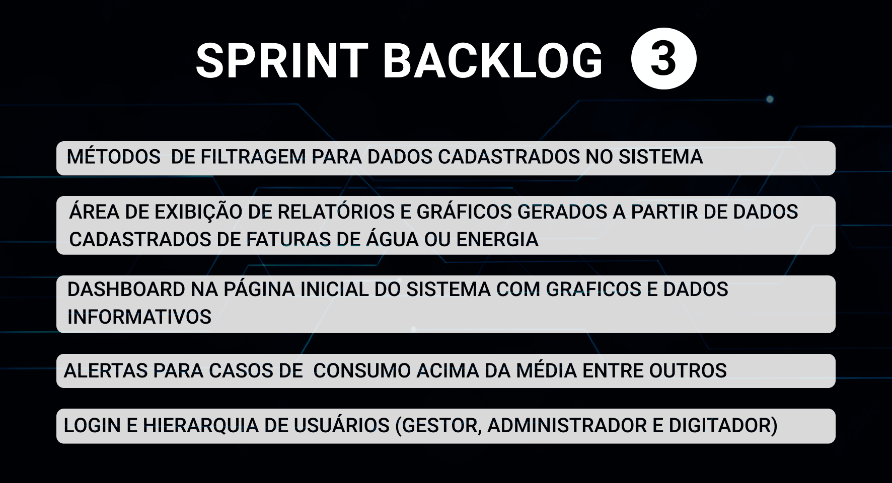</h1>

 

<h2 id="modelo_de_dados" align="center">Modelo de dados</h2>

  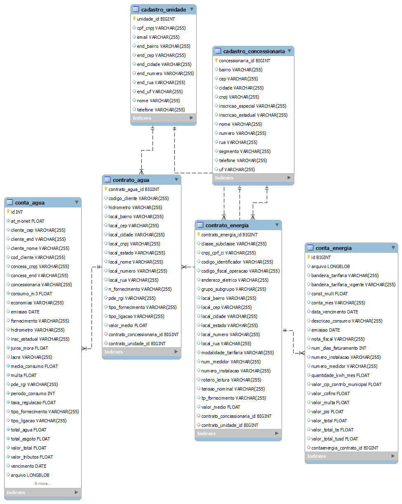

<h2 id="use_cases">Use Cases</h2>

  <table>
    <tr>
      <th>User Story id</th>
      <th>Como um (ator)</th>
      <th>Eu quero (ação)</th>
      <th>Para que seja possível (funcionalidade)</th>
      <th>Prioridade</th>
    </tr>
    <tr>
      <td>17</td>
      <td>Gestor</td>
      <td>Um modo de saber que os cadastros foram feitos, editados e ou excluidos </td>
      <td>Criar um metodo de registro de logs onde a cada cadastro, edicao ou exclusao ele registrara no log</td>
      <td>18</td>
    </tr>
    <tr>
      <td>18</td>
      <td>Cliente</td>
      <td>Ter uma segurança de acesso ao sistema para que não fique aberto a todos</td>
      <td>Criar uma tela de login para que a pessoa entre com usario e senha </td>
      <td>19</td>
    </tr>
    <tr>
      <td>19</td>
      <td>Cliente</td>
      <td>Niveis de acesso no sistema para administrador, gestor e digitador</td>
      <td>Criar um cadastro master(administrador) para que possa criar os subniveis de acesso ao sistema</td>
      <td>20</td>
    </tr>
    <tr>
      <td>20</td>
      <td>Digitador</td>
      <td>Armazenar o arquivo da conta que acabou de ser digitada</td>
      <td>Criar um metodo que possa fazer o upload do pdf, imagem, etc da conta para armazenar no banco de dados</td>
      <td>21</td>
    </tr>
    <tr>
      <td>21</td>
      <td>Gestor</td>
      <td>Imprimir e ou guardar em meu computador os relatorios gerados pelo sistema em formato pdf</td>
      <td>Criar um metodo que imprima na tela os relatorios que foram gerados para dowload</td>
      <td>22</td>
    </tr>
    <tr>
      <td>8</td>
      <td>Gestor</td>
      <td>Fazer analises tecnicas/financeiras, comparar, fazer medias e ter um controle mensal e anual das contas de agua </td>
      <td>Criar uma area com relatorios e graficos dessa contas de agua com metodos de filtragem e onde vai poder visualizar as contas de agua cadastradas, multas e desperdicio de agua</td>
      <td>9</td>
    </tr>
    <tr>
      <td>9</td>
      <td>Gestor</td>
      <td>Fazer analises tecnicas/financeiras, comparar, fazer medias e ter um controle mensal e anual das contas de energia</td>
      <td>Criar uma area com relatorios e graficos dessa contas de energia com metodos de filtragem e onde vai poder visualizar as contas de energia cadastradas , multas e desperdicio de energia</td>
      <td>10</td>
    </tr>
    <tr>
      <td>10</td>
      <td>Gestor</td>
      <td>Ao entrar poder ver alguns graficos e dados do sistema para controles iniciais </td>
      <td>Criare uma  area de dashboard onde vai ser a primeira pagina do sistema com graficos e dados informativos</td>
      <td>11</td>
    </tr>
    <tr>
      <td>11</td>
      <td>Gestor</td>
      <td>Um metodo que avise os alertas de consumo acima da media</td>
      <td>Criar uma area onde vai ter exibir os alertas de consumo acima da media e outros alertas</td>
      <td>12</td>
    </tr>
    <tr>
      <td>12</td>
      <td>Gestor</td>
      <td>Um metodo que de para visualizar os dados com os parametros setados por mim </td>
      <td>Na aba de relatorios vai ser criado alguns campos para que seja adicionados os parametros e filtrar todos os dados dessa area </td>
      <td>13</td>
    </tr>
  </table>

 

<h2 id="wireframes">Wireframes</h2>

<h3 align="center">Tela de Login</h3>

<!-- divs abaixo usadas somente para centralizar as imagens, o align center não estava funciionando na tag img -->

  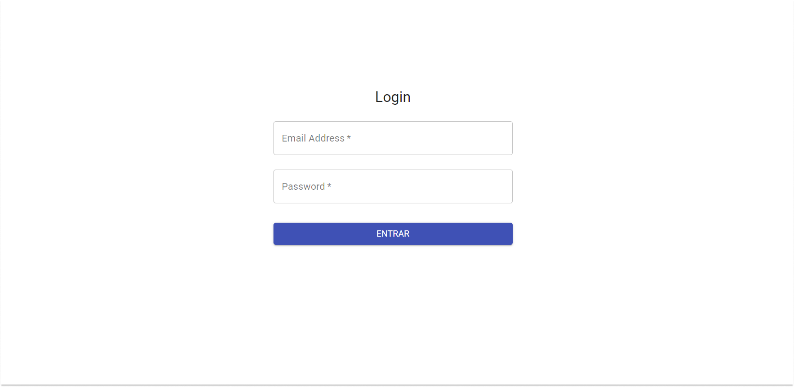

 

<h3 align="center">Área de exibição de alerta de consumo e valores acima da média para as contas de água e energia cadastradas</h3>

  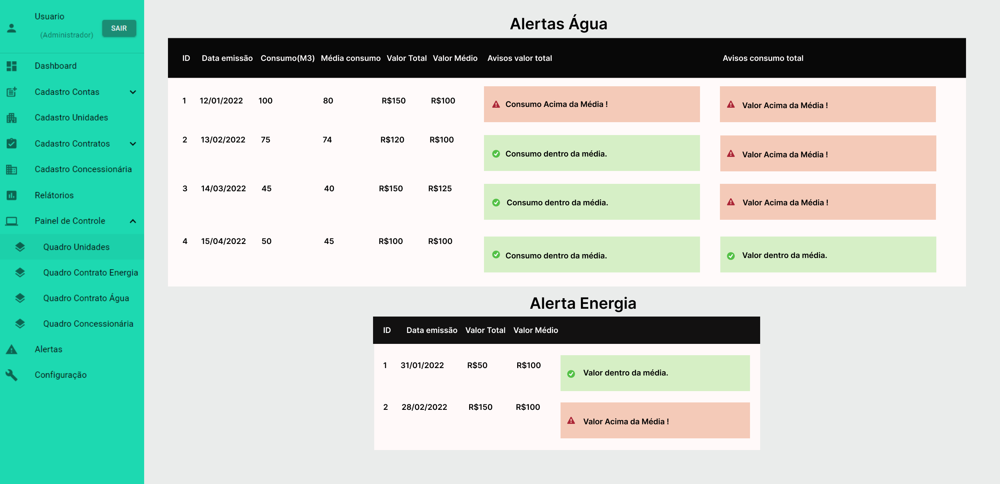
  <!--  -->

 

<h3 align="center">Área de relatórios e gráficos para contas de água cadastradas</h3>

  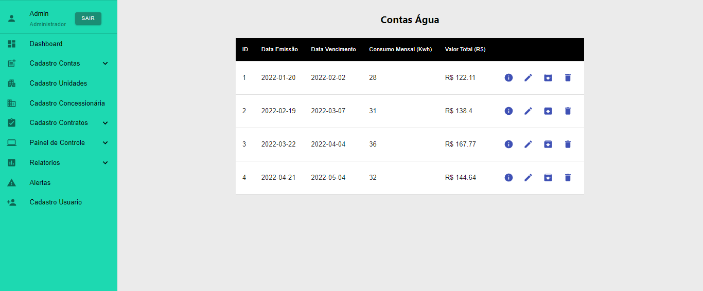

<h4> • Gráfico Consumo Mensal</h4>

  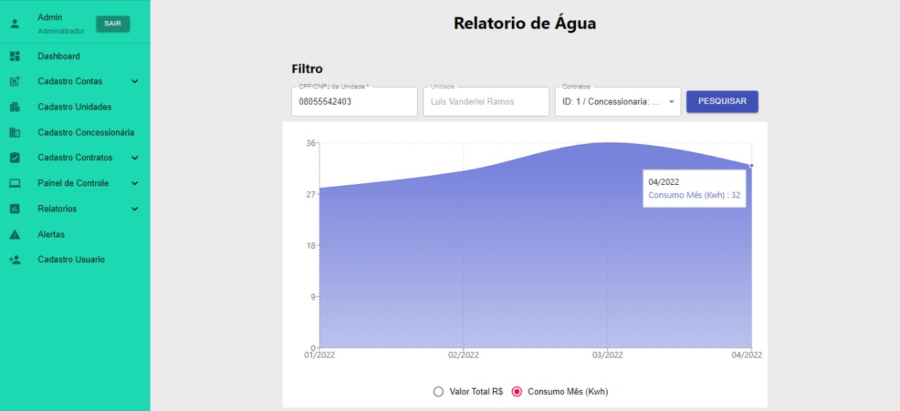

<h4> • Gráfico Valor Total Mensal</h4>

  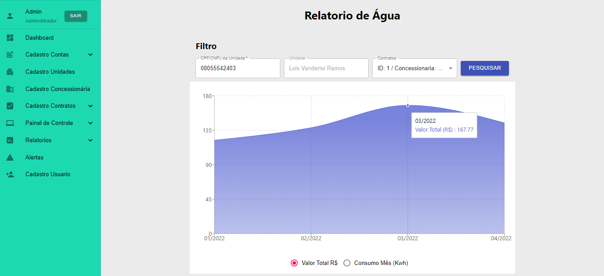

 

<h3 align="center">Área de relatórios e gráficos para contas de energia cadastradas</h3>

<h4> • Relatórios</h4>

  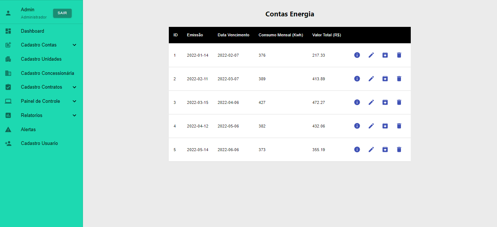

<h4> • Gráfico Consumo Mensal</h4>

  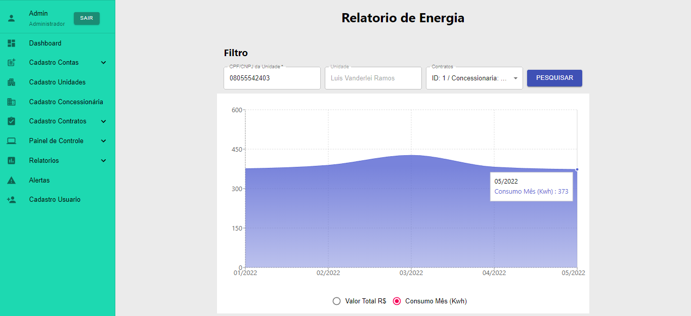

<h4> • Gráfico Valor Total Mensal</h4>

  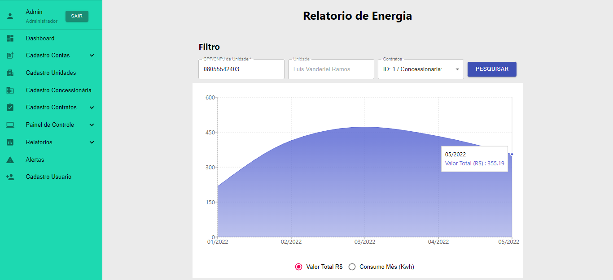

 

<h1 id="dod">Definition of Done<h1>

<h2 id="burndown_sprint_3">Burndown da Sprint<h2>

<h3 align="center">
  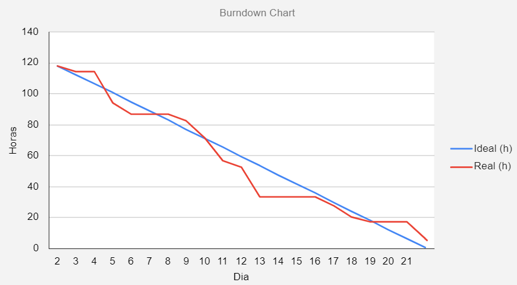
</h3>

 

<h2 id="funcionalidades_sprint_3">Funcionalidades da Sprint</h2>

 

<h3 align="center">Login e níveis de acesso de usuários</h3>

 

<h3 align="center">Dashboard na página inicial</h3>

 

<h3 align="center">Alertas de valores e consumo acima da média</h3>
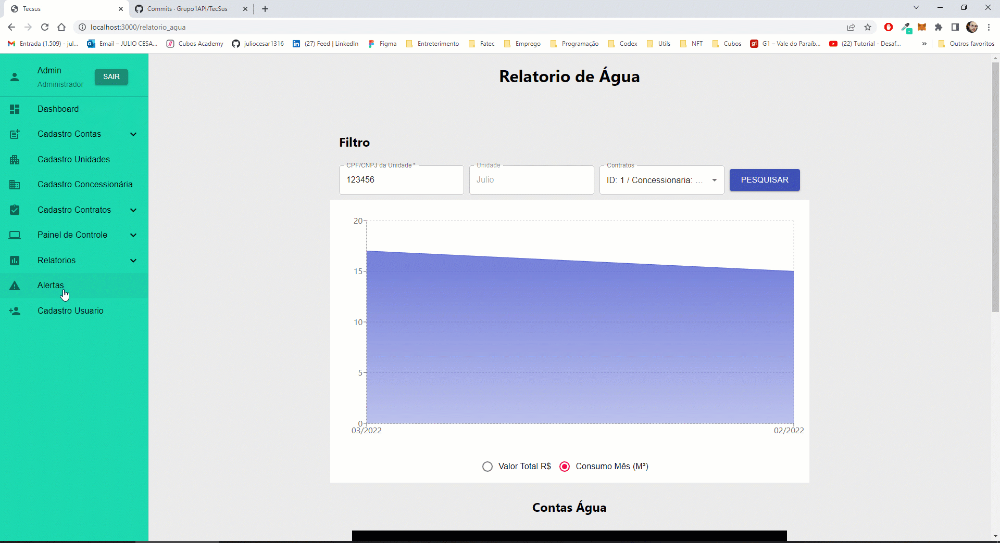

 

<h3 align="center">Relatórias e gráficos de contas de água e energia</h3>

